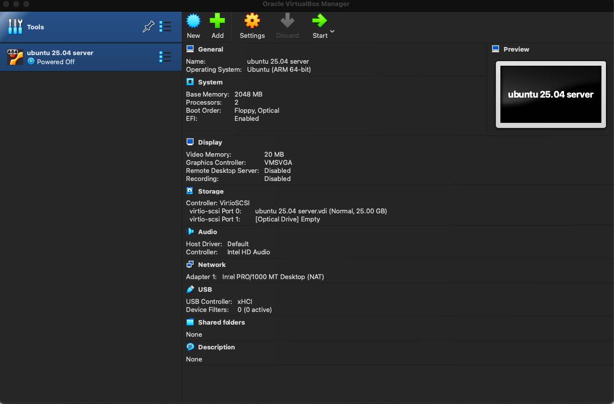
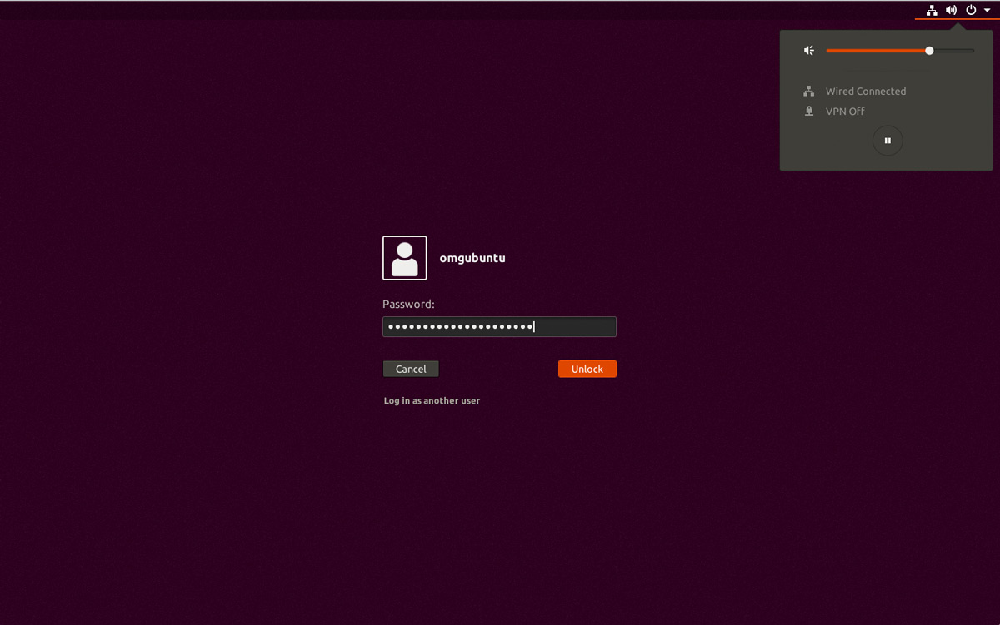

# TECH ENVIRONMENT SETUP

## Introduction
These are steps to set up a tech environment for DevOps Engineers. This guide provides detailed instructions for installing essential software and tools such as Git, Visual Studio Code, VirtualBox, and creating cloud accounts like AWS and GitHub. Each section is linked to official sources for downloads and account setups.

---

## Table of Contents
1. [Tools to Install](#tools-to-install)
2. [Accounts to Create](#accounts-to-create)
3. [Visual Studio Code](#visual-studio-code)
4. [Git](#git)
5. [VirtualBox](#virtualbox)
6. [Ubuntu on VirtualBox (Windows Host)](#ubuntu-on-virtualbox-windows-host)
7. [Ubuntu on VirtualBox (MacOS Host)](#ubuntu-on-virtualbox-macos-host)
8. [Creating GitHub and AWS Accounts](#creating-github-and-aws-accounts)
9. [Amazon Web Services (AWS) Account](#amazon-web-services-aws-account)

---

## Tools to Install
1. Visual Studio Code
2. Git
3. VirtualBox
4. Ubuntu on VirtualBox (MacOS)

## Accounts to Create
1. GitHub
2. AWS

---

## Visual Studio Code
Visual Studio Code is a lightweight but powerful source code editor available for Windows, macOS, and Linux. It supports JavaScript, TypeScript, Node.js, and has a rich ecosystem of extensions for other languages (C++, C#, Java, Python, PHP, Go, .NET, Unity, etc).

### Windows Installation
- Download VS Code from the [official website](https://code.visualstudio.com/ "VScode's Homepage").
  [](https://code.visualstudio.com/)
- Click the download button for your operating system.
- **Run Installer:** Locate and run the downloaded installer file (ext for Windows, dmg for Mac, deb for Linux).
- **Wizard:** Click "Next" to proceed through the installation wizard.
- **Install:** Click install to complete the process. When done, click "Finish."
- **Launch VS Code:** Open the Start menu (Windows) or Applications (Mac), search for Visual Studio Code, and launch it.

If successful, you should see the Visual Studio Code application open:
[](https://code.visualstudio.com/)

---

## Git
Git is a distributed version control system for tracking changes in source code. It is designed for coordinating work among programmers and supports distributed, non-linear workflows.

### Windows Installation
- Download Git from the [official website](https://git-scm.com/downloads/win "Git's Homepage").
  [](https://git-scm.com/downloads/win)
- Click the download button for your Windows OS.
- **Run Installer:** Locate and run the downloaded installer file.
- **Wizard:** Click "Next" to proceed through the installation wizard.
- **Install:** Click install to complete. When done, click "Finish."
- **Launch Git:** Open the Start menu, search for Git, and launch it.

If successful, Git will look like this after launching:
[]

### Mac Installation (with Homebrew)
- **Install Homebrew:** Open Terminal and run:
   ```
   /bin/bash -c "$(curl -fsSL URL_ADDRESS.githubusercontent.com/Homebrew/install/HEAD/install.sh)"
   ```
   **Note:** if homebrew is already installed, you can skip above step.
   * **Git installation:** in your terminal, type the following command:
   ```
   brew install git
   ```
   * **Launch Git:** Open terminal and type git --version to verify that git has been installed successfully.
   if your installation is successful, it will have the following look after launching git on your pc.
   []
   
   **Note:** Other methods to install git on mac can be found [Here](https://git-scm.com/downloads/mac)

   ### Virtual Box
   **1. WIndows installation:**
   - **Download Virtual Box:** Go to [Virtual Box website](https://virtualbox.org/wiki/Downloads)
   

   * On the website, click on the download button for your windows operating system.
   * **Run Installer:** Locate the downloaded installer file and run it.
   * **Wizard:** Click "Next" to proceed through the installation wizard.
   * **Install virtual box** Lastly, click install to complete the installation. when installation is done, click on the finish button to complete the installation.
   
   if the installation is successful, you should see the following look after launching virtual box on your pc.
   []

**2. Mac installation:**
- **Download Virtual Box:** Go to [Virtual Box website](https://www.virtualbox.org/wiki/Downloads)
  
   * **Run Installer:** Locate the downloaded .dmg file (Usually in your downloads folder) and double click on it to run in.
   * **Install virtual box:** Double click on the package file inside the .dmg, and follow the on screen instructions to complete the installation.
   * **security warning:** if you see a security warning, click on "open" to procceed with installation.
   * **System Preferences:** Open system preferences and goto security and privacy, click the lock icom to make changes and enter your password. Alloq the Oracle Coperation system software to load and install.
   * ** Lanching Virtual Box:** Open the application icon in the applications folder or launchpad.

   if the installation is successful, you should see the following look after launching virtual box on your pc.
   

## ubuntu (Linux Distro) or Virtual Box (Windows Host)
   * **Download Ubuntu Desktop ISO file:** Go to [Ubuntu offical website](ubuntu.com/download/desktop)
   

   * **Virtual Box:** Launch your already installed virtualbox.
   * **Create a new virtual machine:**  To create a new VM, Click on NEW or Plus symbol at the top center of the virtual box window.
   * **Configure the virtual machine:** Choose Linux as the type, and Ubuntu as the version Allocate as least 2GB of Ram for the virtual machine, create a virtual hard disk, choosing either dynamic or fixed size, "dynamic" is recommended.
   * **Select on installation file:** Choose the ubuntu .iso file that you downloaded from the ubuntu website.
   * **Start the virtual machine:** Launch the virtual machine and start the ubuntu installation process.
   * **Install Ubuntu:** Follow the on-screen instructions to install Ubuntu, configuring language, keyboard, user account,etc.
   * **complete installation:** Remove the isntallation media when prompted, then power off the virtual machine, and ubuntu will boott to the desktop as shown below , then the you can enter the login credentials you created during the installation process.. ubuntu will boot to dekstop as shown below, then you can enter the login credentials you created during the installation process.
   
   
   ## Ubuntu (Linux Distro) on Virtual Box (MacOS Host)
   * Download Ubuntu Desktop ISO file: Go to [Ubuntu offical website](ubuntu.com/download/desktop)

   
   * **Virtual Box:** Launch your already installed virtualbox.
   * **Create a new virtual machine:**  To create a new VM, Click on NEW or Plus symbol at the top center of the virtual box window.
   * **Configure the virtual machine:** Choose Linux as the type, and Ubuntu as version. allocate as lease 2GB of Ram for the virtual machine.
   * **Create a virtual hard disk:** Choos either dynamic or fixed size, "dynamic" is recommended.
   * **File Location and Size:** Select the location and size for the virtual hard disk, ensure sufficient space for the Ubuntu installation.
   * **Mount Ubuntu ISO:** With the new virtual machine selected, clock on settings. "GO to storage" and click on empty CD/DVD. Controller: IDE and click the disk icon nedt to Optical drive . Choose a disk file and select the downloaded ubuntu.iso file.
   * ** start the virtual machine:** Launch the virtual machine and start the ubuntu installation process.
   * **Install Ubuntu:** Choose language and lock "Install ubuntu.", Follow the intall wizeard , configuring options such as time zone, keybard layout, user account, etc.
   * **Complete Installation:** Once installation completes, click "Restart Now.", After reboot, you maybe neeed to press enter to boot from the virtual hard disk. Ubuntu will boot to desktop as shown below, then you can enter the login credentials you created during the installation process.
   

   ### Possible Errors you may encounter and link to resolve youtube video:
   * when virtualization is not enabled: [Click here](ubuntu.com/download/desktop)
   * C++ redistributable error:[ Click here](URL_ADDRESS.youtube.com/watch?v=77f5z120334)

   ## Creating Github and AWS Accounts:
   Account creation has not thing to do with the type of OS that you use, since they are all third party saas services.

   ## Github account:
   * **Go to the Github website:** Go to [Github website](github.com)
   
   * **Sign up:** Click on the sign up button, fill in your details, and click on the sign up button.
   * **Verify your email:** Check your email for a verification link and click on it to verify your email address.
   * **Complete the sign up:** Fill in the remaining details and click on the sign up button.
   

## Amazon Web Services (AWS) account:
   * **Visit  the aws Free tier page** Go to the AWS Free Tier page as [AWS website](aws.amazon.com/free) to learn about the services avialable in the free tier and to start the signup process.
  
   * **Click "creation of an AWS account":** On the AWS Free Tier page, click on the "create an AWS account" button.
   * **Provide account information:** Fill in your account details, including your name, email address, and phone number.
   * **Select your preferred payment method:** Choose your preferred payment method, such as a credit card or bank account.
   * **Complete the signup:** Click on the "create an AWS account" button to complete the signup process.
   
   
   
   

